<p align="center">
  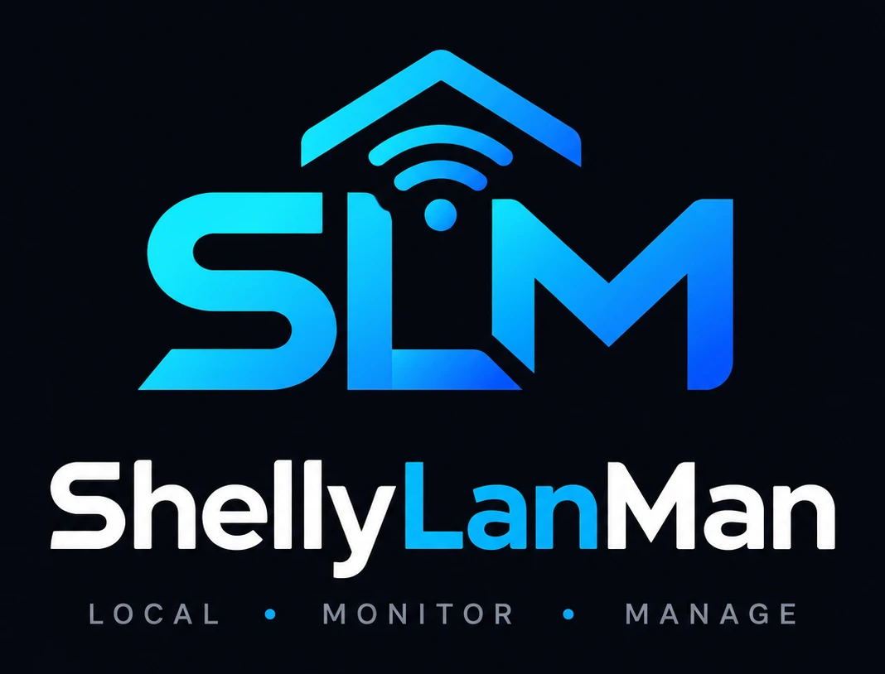
</p>

<p align="center">
  <a href="https://github.com/wimmme/shellylanman/releases"></a>
  <a href="https://github.com/wimmme/shellylanman/actions/workflows/test.yml"></a>
  <a href="https://github.com/wimmme/shellylanman/actions/workflows/github-code-scanning/codeql"></a>
  <a href="https://github.com/wimmme/shellylanman/pkgs/container/shellylanman"></a>
  
  
  
  <a href="LICENSE"></a>
  <a href="https://www.paypal.com/donate/?business=LPS62D2BRTD2Y&amp;no_recurring=0&amp;item_name=You+help+me+buying+coffee+and+tokens+for+coding+%3A-%29&amp;currency_code=EUR"></a>
</p>

# ShellyLanMan

**Discover, monitor and manage Shelly devices on your LAN — one go-to app, with an MCP server for AI assistants.**

A single lightweight Docker container that runs standalone, or inside Home Assistant as
an app with extra features.

ShellyLanMan is a network-based tool for monitoring and managing Shelly IoT devices.
It automatically discovers devices on the local network and shows key information
such as Wi-Fi strength, cloud connectivity, uptime, temperature and meter readings.
Devices can be controlled directly, and configuration backup and restore are
available from the toolbar. Firmware management is built in, with a QR code for a
quick download of the firmware, so you can update a device through the Shelly's
own access point.

It started from [ShellyScanner](https://github.com/usnasoft/shellyscanner) by usnasoft
and is built on its basis — its features, terminology and Shelly know-how — then
developed further as a web application of its own: pages that work together for a
first-time user, an MCP server for AI assistants, a Home Assistant app and integration,
eight languages. No desktop, no VNC, no Java, no cloud.

[Why](#-why-shellylanman) · [Quick start](#-quick-start) · [Features](#-features) ·
[Pages](#-pages) · [Screenshots](#-screenshots) · [AI assistants (MCP)](#-ai-assistants-mcp) · [REST API](#-rest-api) · [Home Assistant](#-home-assistant) · [Security](#-security) ·
[Configuration](#configuration) · [Development](#-development) · [Contributing](#-contributing) · [Support](#-support) · [Credits](#-credits)

## ✨ Why ShellyLanMan

- **One place for every Shelly on the LAN** — Gen1 to Gen4, Pro, BLU through their
  gateways, range-extender clients and protected devices.
- **Runs where your other services run** — one Docker image for `amd64` and `arm64`
  (Raspberry Pi 4/5), opened from any browser, also on a phone.
- **Local first** — nothing leaves your LAN except what ShellyScanner also does (the
  devices' own firmware checks) and an opt-in release check. No account, no telemetry.
- **Firmware without the cloud** — a QR code gives your phone the firmware file from
  ShellyLanMan, to update a device through its own access point.
- **In your language** — English, Nederlands, Deutsch, Français, Español, Italiano,
  Български, 中文.
- **Better than the phone app** — Shelly's own app is built around the cloud and shows
  only part of what the devices can do. ShellyLanMan talks to the devices directly, in
  any browser, also on your phone, with every setting, script, schedule and backup.
- **For AI assistants** — a built-in [MCP server](#-ai-assistants-mcp): Claude Code,
  Claude Desktop or a local model can read your devices and, if you allow it, switch,
  configure and script them. Locally, with confirmation for anything destructive.
- **At home in Home Assistant** — [an app](#-home-assistant) in the sidebar behind Home
  Assistant's login, in Home Assistant's own colours, and an integration that puts
  ShellyLanMan's status, configuration backups and settings checklist next to your
  Shelly devices in Home Assistant, plus its tools for Assist.
- **More than ShellyScanner** — on top of all of ShellyScanner's functions: pages that
  work together (one selection for Devices, Checklist and Firmware, buttons that say
  why they are not available), the MCP server and Home Assistant support above, scenes,
  eight languages, colour palettes (the Home Assistant look by default), installable as
  an app, release notes in the app.

## 🚀 Quick start

Linux with Docker Engine. Save this as `docker-compose.yml` (it is the
[`docker-compose.yml`](docker-compose.yml) of this repository; every option is in it,
the optional ones in comments):

```yaml
# ShellyLanMan — compose file. Every option is listed below; the ones in
# comments are optional.
#
# Host networking is the default on purpose: mDNS discovery needs multicast on
# your LAN, which Docker's bridge network does not pass (ARCHITECTURE.md §2.5).
# Linux only.
#
# Start / apply a change:  docker compose up -d
# Update:                  docker compose pull && docker compose up -d
services:
  shellylanman:
    image: ghcr.io/wimmme/shellylanman:latest
    # Only used when you build from a clone of the repository (docker compose up -d --build).
    build: .
    container_name: shellylanman
    network_mode: host
    # Bridge mode instead (no mDNS discovery; use an IP-range scan): remove
    # network_mode above and map the port, host port on the left:
    # ports:
    #   - "3082:3082"
    volumes:
      - data:/data
    environment:
      - TZ=${TZ:-UTC}                      # time zone of the logs and the UI
      # Port of the web UI and API (default 3082). Settings → General → Ports
      # shows it; change it here and run `docker compose up -d`.
      # - SHELLYLANMAN_PORT=3082
      # Extra allowed browser origins: the host name(s) of your reverse proxy,
      # comma separated.
      # - SHELLYLANMAN_ORIGINS=shelly.example.net
      # Data directory inside the container (default /data, the volume above).
      # - SHELLYLANMAN_DATA=/data
      # Forgotten UI password: uncomment, `docker compose up -d` once (the password
      # is removed, see the log), comment it out again and `docker compose up -d`.
      # - SHELLYLANMAN_RESET_PASSWORD=1
      # Set by the Home Assistant app only — do not set them here:
      # SHELLYLANMAN_INGRESS, SHELLYLANMAN_INGRESS_FROM, SHELLYLANMAN_MCP_LOCAL
    restart: unless-stopped
    logging:
      driver: json-file
      options:
        max-size: "10m"
        max-file: "3"

volumes:
  data:
```

```sh
docker compose up -d
```

Open `http://<your-host>:3082`. There is nothing to configure beforehand: a
first-run dialog appears in the browser.

Or with `docker run`:

```sh
docker run -d --name shellylanman --network host -v shellylanman-data:/data \
  --restart unless-stopped ghcr.io/wimmme/shellylanman:latest
```

Images are published for `linux/amd64` and `linux/arm64` (Raspberry Pi 4/5 with
a 64-bit OS). Tags: `latest`, `X.Y` and `X.Y.Z`.

### Update

```sh
docker compose pull && docker compose up -d
```

Use `docker compose up -d`, not `docker restart` — a restart keeps the old image.
To stay on one release line, use a tag such as `ghcr.io/wimmme/shellylanman:0.9`
instead of `latest`. The changes of each release are in [`CHANGELOG.md`](CHANGELOG.md).

Before a major version, save the data volume (it holds settings, archive, backups):

```sh
docker run --rm -v shellylanman_data:/data -v "$PWD":/backup alpine   tar czf /backup/shellylanman-data.tgz -C /data .
```

(`docker volume ls` shows the volume's name: compose prefixes it with the project
directory, e.g. `shellylanman_data`; the `docker run` example uses `shellylanman-data`). To go back, start the previous tag with the saved
volume content.

### Forgotten password

When a UI password is set (Settings → Security) and forgotten, start ShellyLanMan
once with `SHELLYLANMAN_RESET_PASSWORD=1`: it removes the password and logs out every
browser (the log says so). With compose, uncomment the line in `docker-compose.yml`:

```yaml
    environment:
      - SHELLYLANMAN_RESET_PASSWORD=1
```

then `docker compose up -d`, open ShellyLanMan (no password now), comment the line out
again and `docker compose up -d` once more — otherwise every restart removes the
password again. With `docker run`, start it once with `-e SHELLYLANMAN_RESET_PASSWORD=1`
and then without it. Set a new password in Settings → Security.

In the Home Assistant app there is no environment variable to set: open ShellyLanMan
in Home Assistant's sidebar and change or switch the password off in Settings →
Security — there the current password is not asked, you are logged in to Home
Assistant.

### Why host networking

ShellyLanMan finds devices with mDNS, which uses multicast on your LAN.
Docker's default bridge network does not pass that multicast into the
container, so discovery by mDNS only works with `network_mode: host` (Linux).
In bridge mode (`-p 3082:3082`) everything else works and devices can be found
with an IP-range scan. Details: [`ARCHITECTURE.md` §2.5](ARCHITECTURE.md).

### Configuration

Everything is set in the browser, except what is needed before the UI is up. In
Docker that is a few environment variables — all of them are in
[`docker-compose.yml`](docker-compose.yml), the optional ones in comments; in the Home
Assistant app it is the app's options (Configuration tab), which set the same
variables. *Settings → General → Ports* shows the ports in use and where they are set.

| Variable | Default | Meaning |
|---|---|---|
| `SHELLYLANMAN_PORT` | `3082` | Port of the web UI and API. Home Assistant app: option `port` |
| `SHELLYLANMAN_ORIGINS` | — | Extra allowed browser origins (host names), comma separated, e.g. your reverse proxy's name |
| `SHELLYLANMAN_DATA` | `/data` | Data directory |
| `SHELLYLANMAN_RESET_PASSWORD` | — | `1`: remove the UI password at start (forgotten password); remove the variable again afterwards |
| `TZ` | `UTC` | Time zone for logs |

Set by the Home Assistant app's start script only (do not set them yourself):

| Variable | From | Meaning |
|---|---|---|
| `SHELLYLANMAN_INGRESS` | — | Listener for Home Assistant's sidebar, on a free port the Supervisor chooses |
| `SHELLYLANMAN_INGRESS_FROM` | — | The only address that listener accepts (the Supervisor) |
| `SHELLYLANMAN_MCP_LOCAL` | options `mcp_local`, `mcp_local_port` (8097) | Token-less access on 127.0.0.1 for Home Assistant on the same host (MCP, the integration) |

### Shellys with a password

Supported, as in ShellyScanner. Protected Shellys show up as **not logged** until
ShellyLanMan knows their password:

- **One password for all** — *Settings → Network → Restricted login*: the user (Gen1;
  Gen2+ always use `admin`) and password ShellyLanMan tries on every protected Shelly.
- **Per device** — tick the device and press **Login** (the *Reload* button becomes
  *Login* for a device that is not logged in): its own password, which wins over the
  default.

The passwords are stored encrypted in `/data` and never sent back to the browser. With
the Home Assistant integration, *Add Shellys to Home Assistant* passes them on to Home
Assistant's Shelly integration, so you do not type them twice.

### What is stored in `/data`

| File | Content |
|---|---|
| `secret.key` | Random key created on first start; encrypts secrets in `settings.json` |
| `listen.port` | The port in use, for Docker's health check |
| `settings.json` | Application settings; device credentials encrypted |
| `archive.json` | Device archive: known devices, last address, notes and keywords |
| `deferred.json` | Deferred tasks for offline devices (passwords encrypted) |
| `sessions.json` | Logged-in browsers when a UI password is set (only hashes of the session ids) |
| `backups/<device>/*.sbk` | Device backups (newest N per device, setting) |
| `firmware/` | Verified firmware files of the local download (cache) |

Chart readings are kept in memory only (24 hours). Details:
[`ARCHITECTURE.md` §2.6](ARCHITECTURE.md).

### Behind a reverse proxy

Terminate TLS at the proxy, forward WebSocket upgrades for `/ws`, and set
`SHELLYLANMAN_ORIGINS` to the public host name. The UI password is off by
default — set one in Settings → Security, or add authentication at the proxy,
if the UI is reachable beyond your own LAN. See [`SECURITY.md`](SECURITY.md).

## 🧭 Features

Everything ShellyScanner does, in the browser, and pages that work together:

- **One selection** for Devices, Checklist and Firmware: tick devices on one page and
  the others show those devices (or all, with one click). Every button says what it
  does and, when it is grey, why.

- **Discovery** by mDNS (all interfaces or one), IP-range scan or offline, Gen1 to
  Gen4, Pro, BLU devices through their gateways (also the ones a gateway only relays,
  with a wizard that identifies their model), range-extender clients, protected
  devices, an archive of known devices with notes and keywords.
- **Devices table** with all columns, filters, views, device information, live logs,
  controls (relays, rollers, lights, thermostats, …), reboot, CSV export and print.
- **Configuration** of one or many devices (Wi-Fi, login, MQTT, NTP, cloud, …), the
  configuration checklist and deferred tasks for devices that are offline.
- **Backup and restore** (`.sbk`, compatible with ShellyScanner), kept on the server.
- **Firmware** check and update with live progress, plus one new feature: a **QR code
  for a local firmware download**, to update a device through its own access point.
- **Scripts** (with a code editor) and KVS, **schedulers** (Gen2+, Wall Display
  thermostat, BLU TRV) and **charts** with 24 hours of history.
- **Appearance**: dark and light themes, colour palettes, fonts and sizes, per browser.
- **Installable app** (PWA) on phones, tablets and desktops when ShellyLanMan is served
  over HTTPS (for example behind a reverse proxy) or on `localhost`; on a plain
  `http://<ip>:3082` browsers offer only a home-screen shortcut.

What leaves your LAN: the devices' own firmware checks (as with ShellyScanner); Shelly's
firmware index when you open the Firmware page; the ShellyLanMan release check only
if you switch it on (off by default). No telemetry.

## 📑 Pages

| Page | What it is for |
|---|---|
| **Devices** | The live table of every device (and a wizard to set up a new Shelly with a profile): status, type, name, IP, RSSI, cloud, MQTT, uptime, temperature, measurements and controls. Tick devices, then use the toolbar: Checklist and Firmware for the selection; web UI, settings, charts, backup, restore, reload and reboot for one or more devices; info, logs, scheduler, scripts and notes for one device. Refresh reads the devices' status, Rescan searches the network again. |
| **Checklist** | One row per device with the settings worth checking — eco mode, LED, logs, Bluetooth, access point, roaming, Wi-Fi, range extender, scripts, automatic firmware update. Tick devices and switch a setting with the buttons (or right-click a cell). |
| **Charts** | Power, energy, voltage, temperature, RSSI and more for the selected devices, with 24 hours of history, zoom, pause and CSV export. |
| **Firmware** | Current, stable and beta firmware of the selected devices (or all), update with live progress, and a wizard with QR codes to update a device through its own access point (also one ShellyLanMan does not know). |
| **Deferred** | Actions for offline devices, run when the device comes back. |
| **Log** | ShellyLanMan's own log: the last 1000 lines of this run, live, with a filter by level and text, pause, clear and copy. Kept in memory only. |
| **Settings** | Scan mode and IP ranges, archive, profiles for new Shellys (name, login, MQTT, time server, …), device credentials, backups, the ports in use and where they are set, script editor, appearance (palette, font, how device pages open) and language. |
| **About** | What is running (version, runtime, uptime), release notes, dependencies with their licences, credits and help. |

## 📸 Screenshots

| | |
|---|---|
| 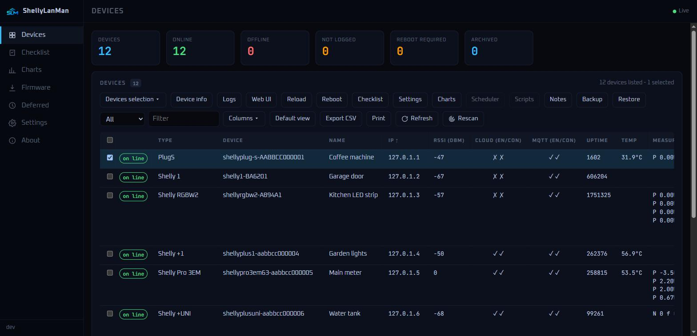 | 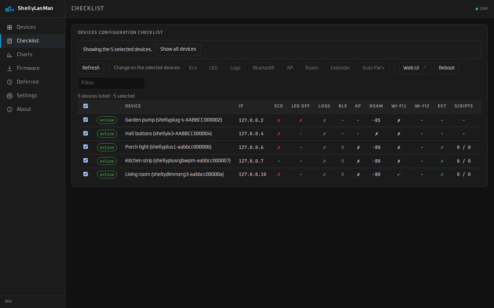 |
| **Devices** — every Shelly with its readings and controls (here a dimmer's slider); three ticked | **Checklist** — the same selection, settings worth checking |
| 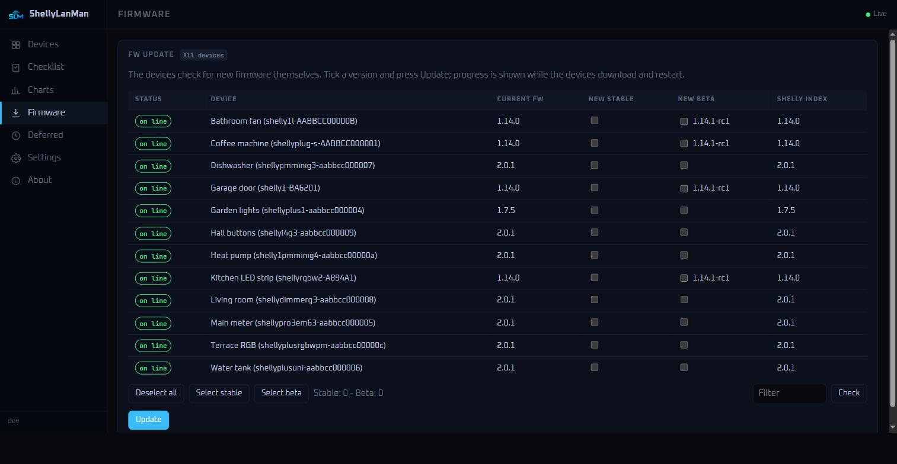 | 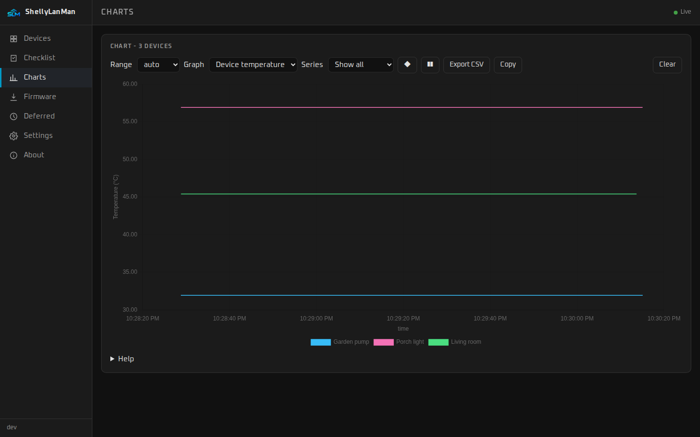 |
| **Firmware** — current, stable and beta, and the Shelly index | **Charts** — readings of the selected devices over time |
| 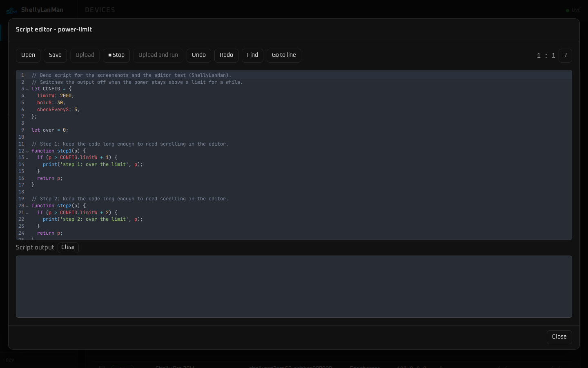 | 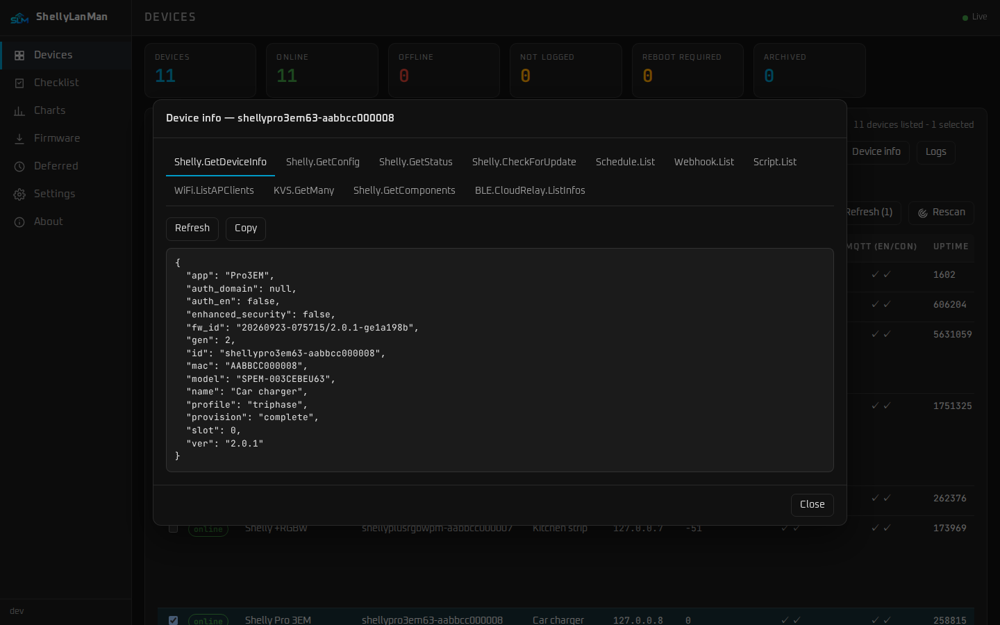 |
| **Script editor** — edit, upload and run the device's scripts | **Device info** — everything the device reports |
| 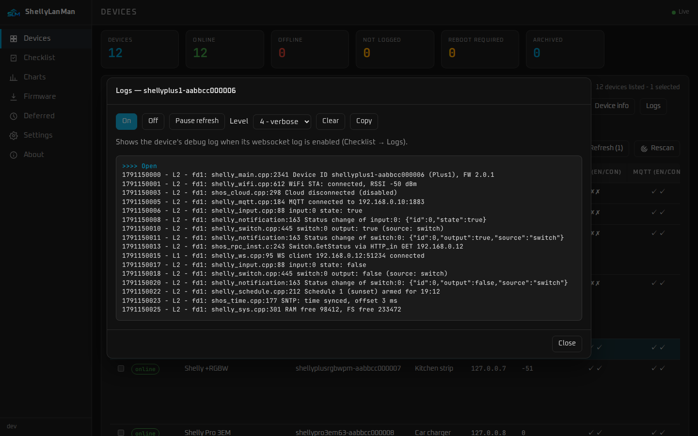 | 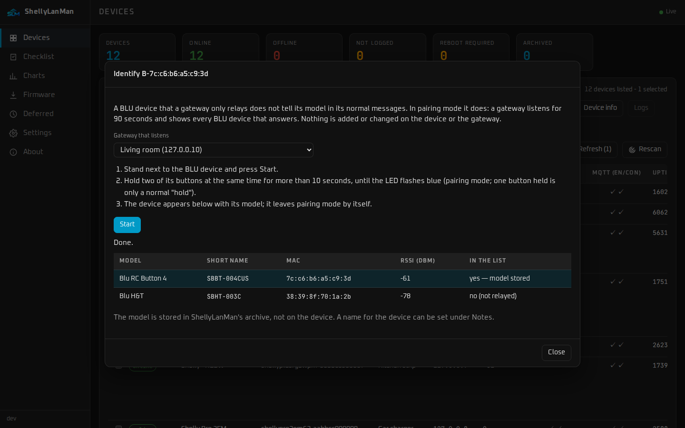 |
| **Logs** — the device's live debug log | **Identify BLU devices** — the model of a BLU device a gateway only relays |
| 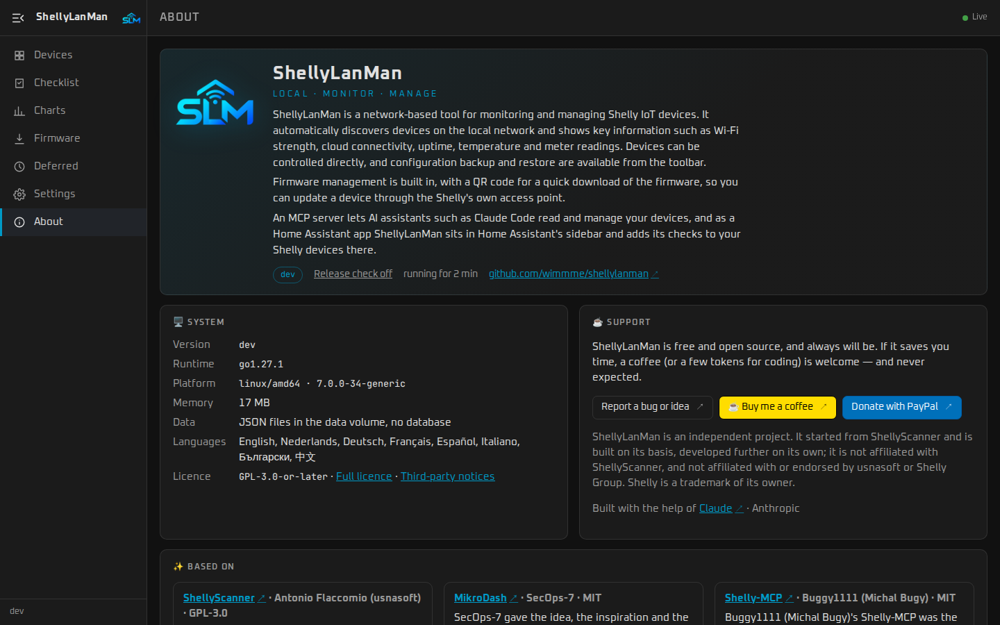 | |
| **About** — version, system information and support | |

On a phone the pages get the full width; the navigation is behind ☰:

<p>
  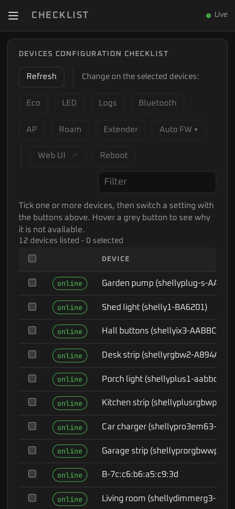
  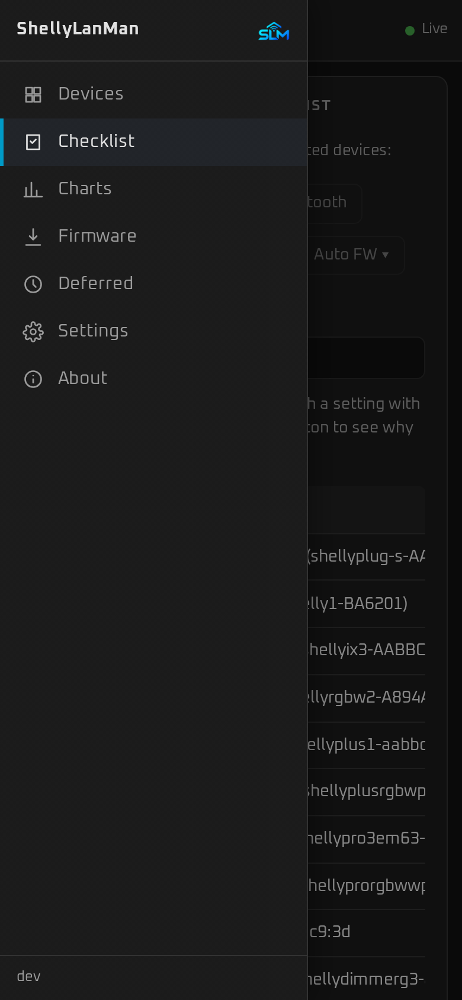
</p>

## 🤖 AI assistants (MCP)

ShellyLanMan has a built-in [Model Context Protocol](https://modelcontextprotocol.io)
server, so an AI assistant — Claude Code, Claude Desktop, or a local model — can ask
about your devices and, if you allow it, switch them. It is **local only**: the
assistant talks to ShellyLanMan, ShellyLanMan talks to the devices on your LAN. No
Shelly cloud account, nothing leaves your network except what your AI client itself
sends to its model.

Switch it on in **Settings → MCP**. That makes a token (shown once) and gives you the
command to paste, for example:

```sh
claude mcp add --transport http shellylanman http://<your-host>:3082/mcp \
  --header "Authorization: Bearer <token>"
```

| Tools | |
|---|---|
| Read (always) | `shelly_list_devices`, `shelly_get_device`, `shelly_get_status` and `shelly_get_config` (raw, Gen1 too; passwords masked), `shelly_list_components`, `shelly_get_readings` (24 h of history), `shelly_energy_history` (EM meters), `shelly_firmware_check`, `shelly_checklist`, `shelly_list_backups`, `shelly_script_code`, `shelly_scenes`, `shelly_rpc_read` (Gen2+ `Get*`/`List*` methods, e.g. KVS, schedules, scripts, webhooks) |
| Control (*read and control*) | `shelly_switch` (with a flip-back timer), `shelly_light` (with a fade), `shelly_cover`, `shelly_thermostat`, `shelly_scene_run`, `shelly_backup`, `shelly_rescan`; with `confirm: true`: `shelly_reboot`, `shelly_firmware_update` |
| Configure (*read, control and configure*) | `shelly_kvs_set`, `shelly_schedule_set`, `shelly_script_create`, `shelly_script_run`, `shelly_webhook_set`, `shelly_virtual_add`, `shelly_scene_set`; with `confirm: true`: `shelly_kvs_delete`, `shelly_schedule_delete`, `shelly_script_put_code`, `shelly_script_eval`, `shelly_script_delete`, `shelly_webhook_delete`, `shelly_virtual_delete`, `shelly_scene_delete`, `shelly_rpc_write` (any Gen2+ method; factory reset also needs `allow_data_loss`), `shelly_device_login` |

Scenes are named lists of device actions stored in ShellyLanMan (`/data/scenes.json`).

Off by default, read-only unless you choose otherwise, a bearer token on every
request, browser requests from other sites refused, and every action that changes
something written to the log. Devices are named by name, host name, IP or MAC.

## 🔌 REST API

Everything the web page does goes through a REST API under `/api/v1`, and anything you
can do in the page you can do from a script. It is described in **OpenAPI 3.1** at
`/api/v1/openapi.json` (also linked on the About page): import it into Postman, Swagger UI
or a code generator. It is on the same address and port as the page, so any machine on
your LAN can use it. With a UI password set, send the session cookie or the MCP token as
`Authorization: Bearer <token>` (a read-only token may only read); without a password
no login is needed. Changes are pushed over the WebSocket `/ws`.

## 🏠 Home Assistant

[`shellylanman-ha`](https://github.com/wimmme/shellylanman-ha) packages ShellyLanMan
for Home Assistant:

- **App** (Home Assistant OS): ShellyLanMan in the sidebar, behind Home Assistant's
  login, with a *Home Assistant* look in light and dark.
- **Integration** (HACS): ShellyLanMan's status, configuration backup and settings
  checklist per Shelly, on a device that Home Assistant links to the Shelly
  integration's device, and ShellyLanMan's tools for Assist. Works with the app and
  with the Docker container.

The Shellys themselves — relays, lights, meters — come from Home Assistant's own Shelly
integration. The ShellyLanMan integration helps there: *Configure → Add Shellys to Home
Assistant* lists the Shellys ShellyLanMan knows that the Shelly integration does not
have yet (also the ones Home Assistant did not discover) and adds the ticked ones
through the Shelly integration's own steps, passwords included when ShellyLanMan may
hand them out.

[](https://my.home-assistant.io/redirect/supervisor_add_addon_repository/?repository_url=https%3A%2F%2Fgithub.com%2Fwimmme%2Fshellylanman-ha)
[](https://my.home-assistant.io/redirect/hacs_repository/?owner=wimmme&repository=shellylanman-ha&category=integration)

Step by step: [`shellylanman-ha`](https://github.com/wimmme/shellylanman-ha#readme).
Questions, ideas, feedback: the [thread on the Home Assistant Community](https://community.home-assistant.io/t/shellylanman-see-and-manage-every-shelly-on-your-lan-add-them-to-home-assistant-in-one-go/1027535).

## 🔒 Security

- **Keep it on your LAN.** ShellyLanMan can change the configuration of your devices;
  do not expose it to the internet. For remote access use a reverse proxy with TLS
  **and** authentication.
- **Optional password** (Settings → Security, off by default) — one password, no user
  name; a login page with *Stay logged in*; slower after five wrong tries. Without it
  anyone who can reach the port can use ShellyLanMan; a warning is logged at start and
  shown once per browser. In Home Assistant's sidebar Home Assistant's login applies.
  Forgotten: see [Forgotten password](#forgotten-password).
- **Secrets at rest** — device and Wi-Fi passwords are encrypted in `/data` with
  AES-256-GCM; they are never sent back to the browser.
- **Browser protection** — same-origin checks on every state-changing request and the
  WebSocket, a strict Content Security Policy, no third-party scripts or fonts.
- **Destructive actions** (reboot, restore, firmware update, port change) always ask
  for confirmation, and the API requires `confirm: true`.
- **MCP** is off by default, needs a token, and is read-only unless you allow control
  or configuration.
- Report vulnerabilities privately: see [`SECURITY.md`](SECURITY.md).

## 💻 Development

Only Docker is needed:

```sh
sh tools/verify.sh     # typecheck, tests, gofmt, vet, go test -race, image build
```

Try it without hardware: `go run ./cmd/shellysim testdata/gen1/SHPLG-S testdata/gen2/Plus1`
starts simulated devices on ports 8081 and 8082. See [`CONTRIBUTING.md`](CONTRIBUTING.md).

## 🤝 Contributing

Issues and pull requests are welcome, from typo fixes to new pages. Check the
[open issues](https://github.com/wimmme/shellylanman/issues) first, and open one before a
large change so the approach can be agreed. You do not need Shelly devices to
contribute: the simulator (`cmd/shellysim`) plays recorded devices. See
[`CONTRIBUTING.md`](CONTRIBUTING.md).

## ☕ Support

ShellyLanMan is free and open source, and always will be. If it saves you time, a
coffee (or a few tokens for coding) is welcome — and never expected.

<a href="https://buymeacoffee.com/wimmme"></a>
<a href="https://www.paypal.com/donate/?business=LPS62D2BRTD2Y&no_recurring=0&item_name=You+help+me+buying+coffee+and+tokens+for+coding+%3A-%29&currency_code=EUR"></a>

Bugs and ideas: [open an issue](https://github.com/wimmme/shellylanman/issues/new).

## 🙏 Credits

- **[ShellyScanner](https://github.com/usnasoft/shellyscanner)** by Antonio
  Flaccomio (usnasoft) — the starting point and the basis of ShellyLanMan: its
  features, the terminology and the Shelly know-how, and code ported from it
  (GPL-3.0). ShellyLanMan has since been developed further on its own. More at
  https://www.usna.it/shellyscanner/. Beyond the credits, he deserves a coffee too.
- **[MikroDash](https://github.com/SecOps-7/MikroDash)** by SecOps-7 — the idea, the
  inspiration and the basis of the look and feel: design tokens, palettes and
  appearance settings (MIT). Beyond the credits, SecOps-7 deserves a coffee too.
- **[Shelly-MCP](https://github.com/Buggy1111/shelly-mcp)** by Buggy1111 (Michal Bugy)
  — the model for ShellyLanMan's MCP server: its tools for AI assistants, the
  confirmation gates and scenes (MIT; no code taken). Beyond the credits, he deserves a
  coffee too.
- CodeMirror 6 (script editor), Chart.js (charts), go-qrcode (QR codes) — MIT;
  fonts under the SIL Open Font License. Full list in
  [`THIRD_PARTY_NOTICES.md`](THIRD_PARTY_NOTICES.md).

## ⚖️ Disclaimer

ShellyLanMan is an independent project. It started from ShellyScanner and is built
on its basis, developed further on its own; it is not affiliated with ShellyScanner,
and not affiliated with or endorsed by usnasoft or Shelly Group. Shelly is a trademark
of its owner.

## 📄 Licence

[GPL-3.0-or-later](LICENSE).

---

<p align="center"><sub>Built with the help of <a href="https://claude.ai">Claude</a> by Anthropic.</sub></p>
